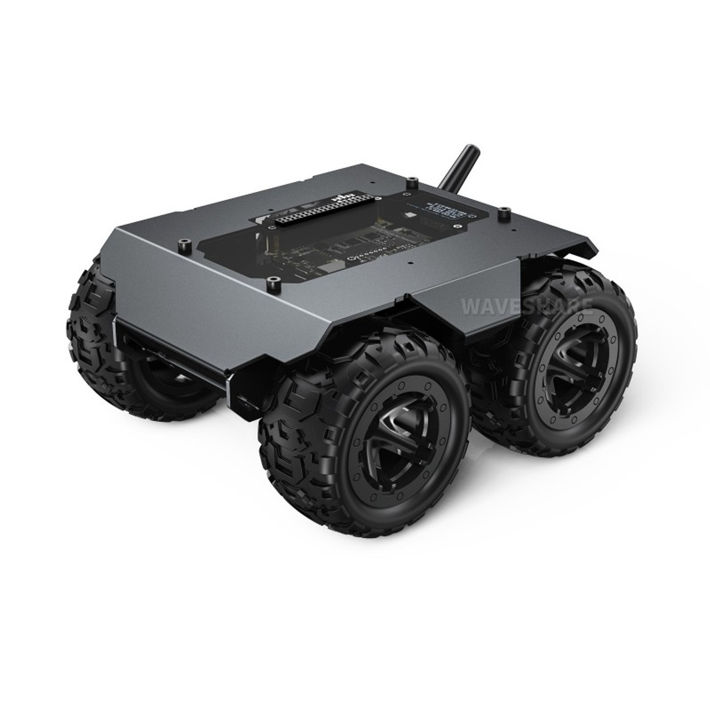
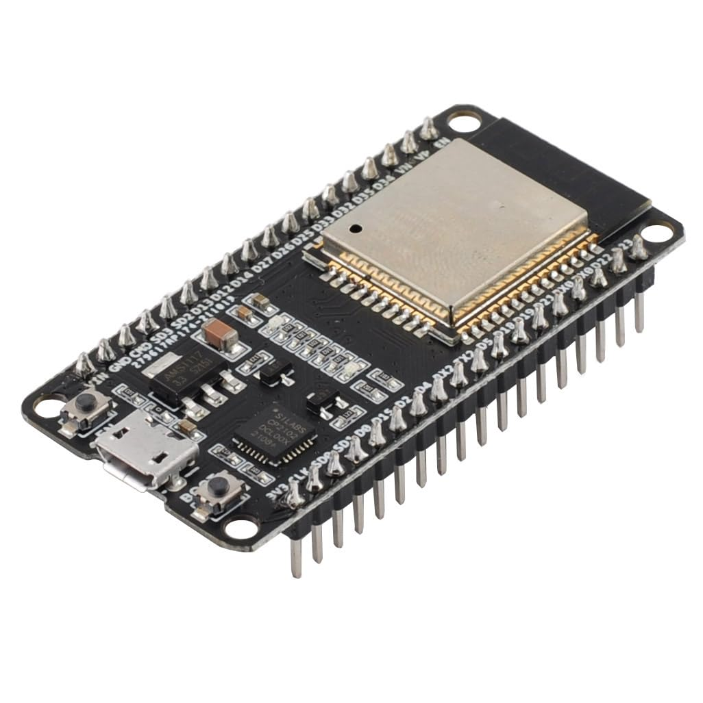
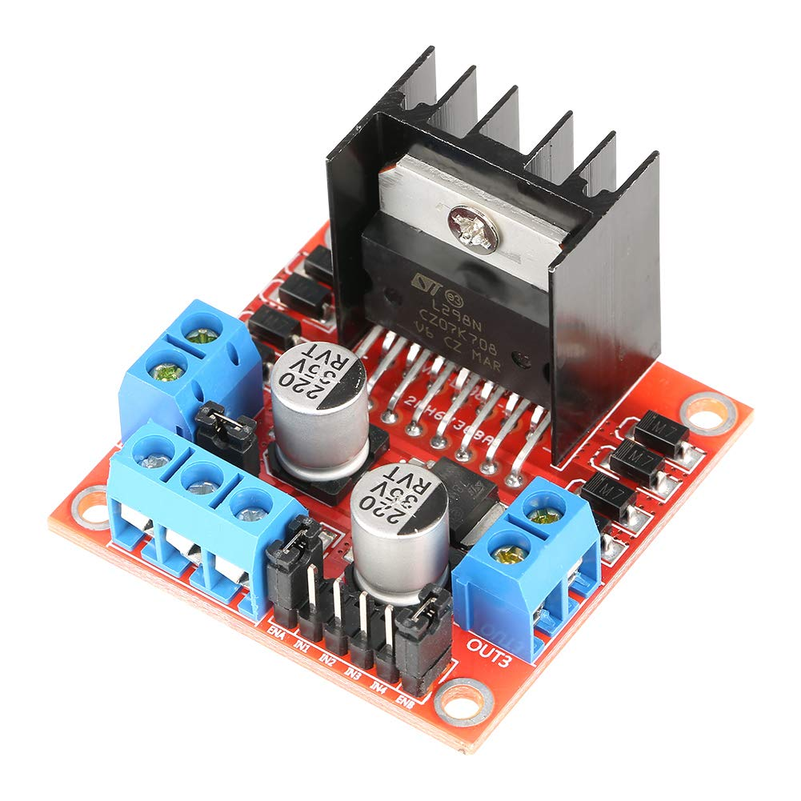
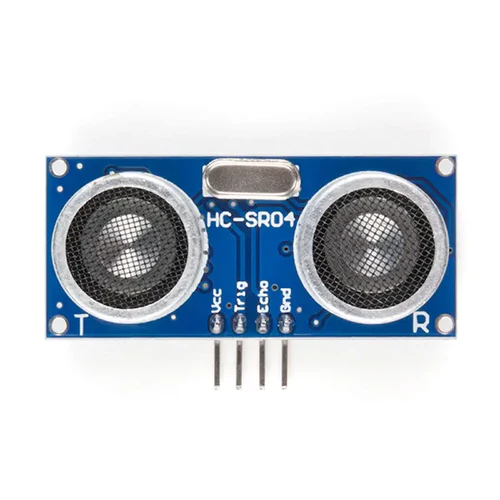
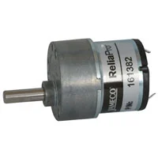
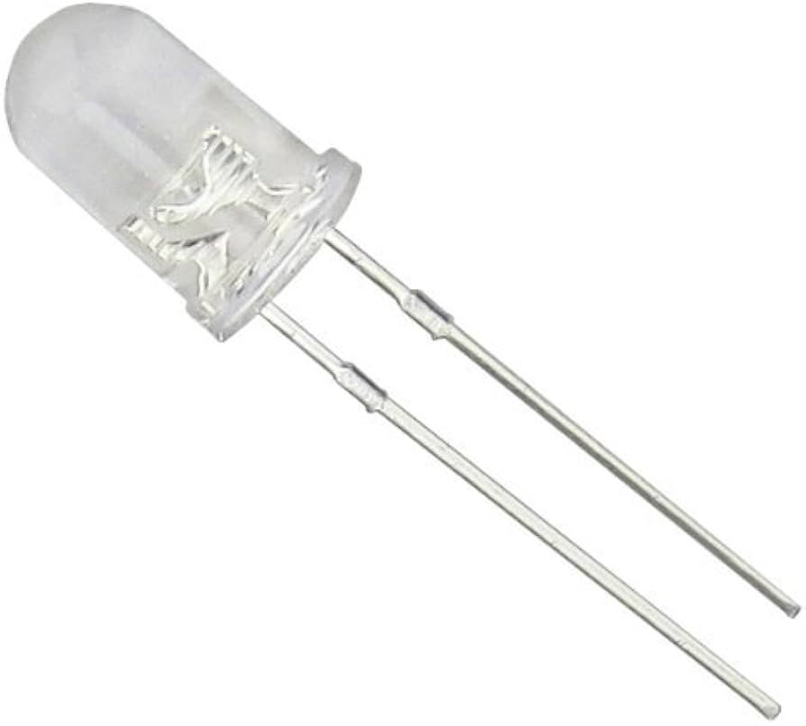
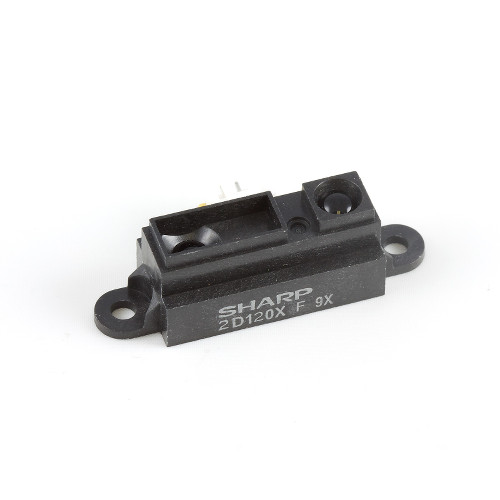
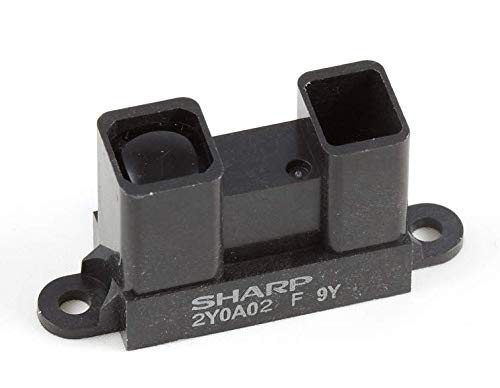
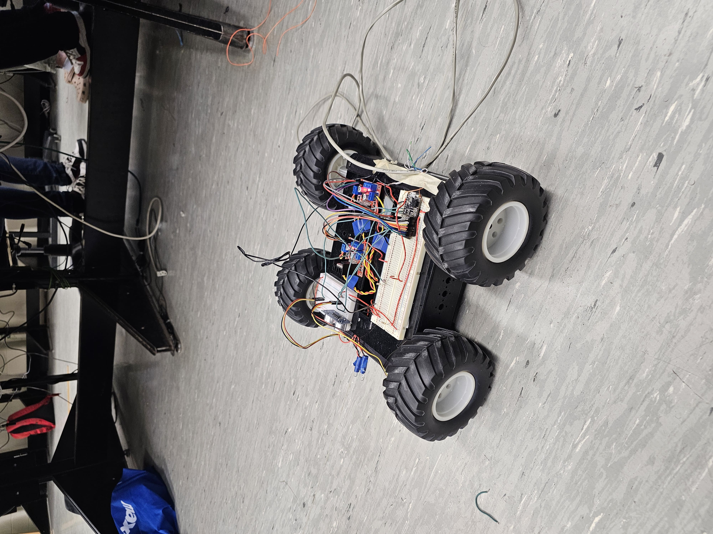

# Wii Remote Controlled Rover With ESP8266 And Raspberry Pi 4

This project demonstrates how to control a rover using a Nintendo Wii Remote, connected wirelessly to an ESP8266. The ESP8266 receives data from the Wii Remote and sends commands to the rover's motors, allowing the user to control the rover's movement remotely through an intuitive user interface that provides real-time feedback and customizable controls.

## Required Components (images)
- Rover shell

- ESP82866

- L298N Motor Drivers | x4

- Nintendo Wii Remote

- HC-SR04 Ultrasonic sensor

- HN_GH12_1634T | x4

- White LED | x2

- Sharp_2D120X

- Sharp_2Y0A02

*See the **Project Purchase Links** category for purchase links*

## Features

- Control rover movement (forward, backward, left, right)
- Full integration with the Wii Remote buttons
- Wireless communication via ESP8266
- Internet graphical user interface

## Setup Instructions

### Hardware Setup

1. **ESP8266**: Connect the ESP8266 to your motor driver and rover motors according to your motor driver specifications (e.g., L298N).
2. **Motor Driver (L298N)**: Wire the motor driver to the motors of your rover. Use jumper wires to connect the motor driver to the GPIO pins of the ESP8266.
3. **Power Supply (12V 2A)**: Power the ESP8266 and motor driver using an appropriate power supply. Typically, the ESP8266 can be powered with a 5V USB adapter, and the rover's motors need a separate battery (12V 2A power source).

### Software Setup

**Pairing the Wii Remote**: Pair the Wii Remote with the ESP8266 using Bluetooth. You will need to press 1 & 2 botton at the same time to connect to the ESP8266. The Player 1 LED will be on when it's connected.

## Conclusion
In conclusion, this project successfully demonstrates how to wirelessly control a rover using a Nintendo Wii Remote and an ESP8266. By integrating Bluetooth communication, motor drivers, and a user-friendly interface, users can enjoy intuitive control of the rover's movement. With customizable features and real-time feedback, this project offers a seamless experience for remote rover operation.

*Representation of the project assembly*

# Version of Functional Files for this Project
- /Codes/.html ---> **Control Website.html and Troubleshooting Website.html**
- /Codes/.ino, .cpp and .h ---> **Wii_Remote_Controlled_Rover_With_ESP8266 folder**

# Problem(s) Encountered
See /Problems_Encountered ---> Problems Encountered.txt

# Project Purchase Links
See /Project Purchase Links ---> Project Purchase Links.txt

# Additional Information Links
- [Arduino-ESP32Wiimote librarie](https://github.com/bigw00d/Arduino-ESP32Wiimote)
